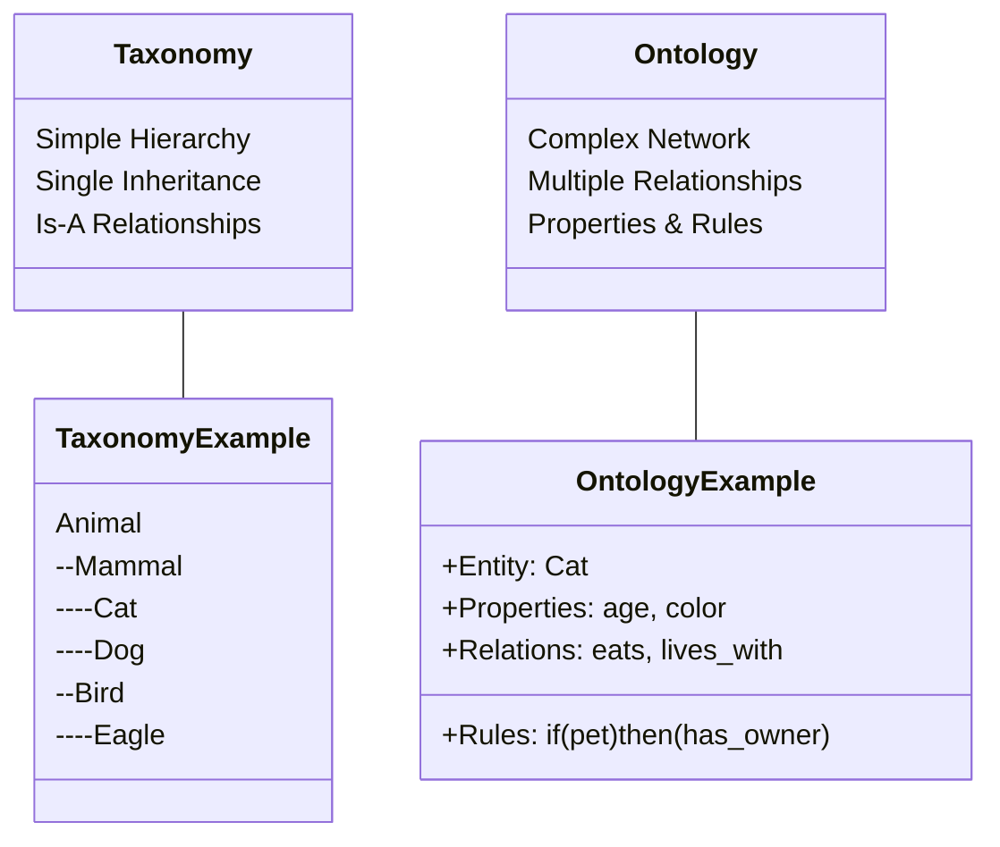

```mermaid
classDiagram
    class Taxonomy {
        Simple Hierarchy
        Single Inheritance
        Is-A Relationships
    }

    class TaxonomyExample {
        Animal
        --Mammal
        ----Cat
        ----Dog
        --Bird
        ----Eagle
    }

    class Ontology {
        Complex Network
        Multiple Relationships
        Properties & Rules
    }

    class OntologyExample {
        +Entity: Cat
        +Properties: age, color
        +Relations: eats, lives_with
        +Rules: if(pet)then(has_owner)
    }

    Taxonomy -- TaxonomyExample
    Ontology -- OntologyExample
```