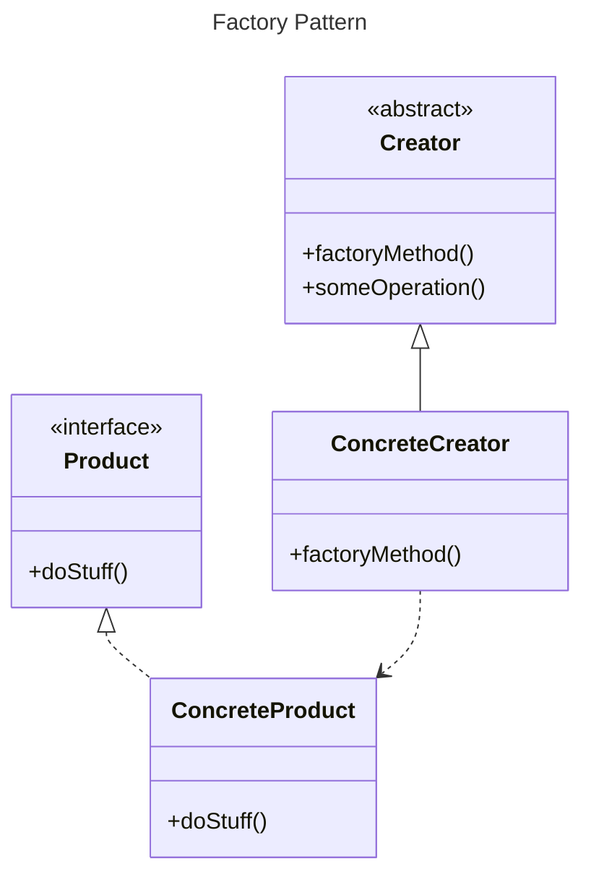

```mermaid
---
title: Factory Pattern
---
classDiagram
    class Creator {
        <<abstract>>
        +factoryMethod()
        +someOperation()
    }
    class ConcreteCreator {
        +factoryMethod()
    }
    class Product {
        <<interface>>
        +doStuff()
    }
    class ConcreteProduct {
        +doStuff()
    }

    Creator <|-- ConcreteCreator
    Product <|.. ConcreteProduct
    ConcreteCreator ..> ConcreteProduct
```
