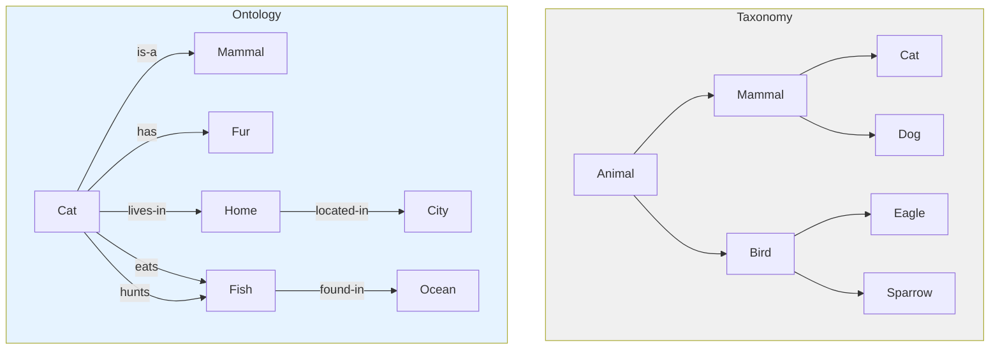

```mermaid
graph TD
    subgraph Taxonomy
        A[Animal] --> B[Mammal]
        B --> C[Cat]
        B --> D[Dog]
        A --> E[Bird]
        E --> F[Eagle]
        E --> G[Sparrow]
    end

    subgraph Ontology
        H[Cat] -->|is-a| I[Mammal]
        H -->|has| J[Fur]
        H -->|lives-in| K[Home]
        H -->|eats| L[Fish]
        K -->|located-in| M[City]
        L -->|found-in| N[Ocean]
        H -->|hunts| L
    end

    style Taxonomy fill:#f0f0f0
    style Ontology fill:#e6f3ff
```