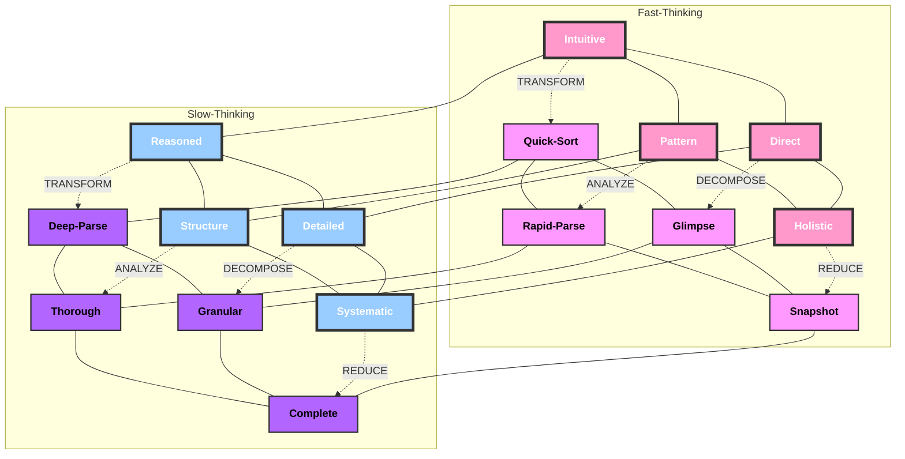

```mermaid
graph TD
    subgraph FastSpace[Fast-Thinking]
        A1["Intuitive"] --- B1["Pattern"]
        B1 --- C1["Holistic"]
        A1 --- D1["Direct"]
        D1 --- C1

        A2["Quick-Sort"] --- B2["Rapid-Parse"]
        B2 --- C2["Snapshot"]
        A2 --- D2["Glimpse"]
        D2 --- C2

        %% Fast thinking connections
        A1 -. "TRANSFORM" .-> A2
        B1 -. "ANALYZE" .-> B2
        C1 -. "REDUCE" .-> C2
        D1 -. "DECOMPOSE" .-> D2
    end

    subgraph SlowSpace[Slow-Thinking]
        E1["Reasoned"] --- F1["Structure"]
        F1 --- G1["Systematic"]
        E1 --- H1["Detailed"]
        H1 --- G1

        E2["Deep-Parse"] --- F2["Thorough"]
        F2 --- G2["Complete"]
        E2 --- H2["Granular"]
        H2 --- G2

        %% Slow thinking connections
        E1 -. "TRANSFORM" .-> E2
        F1 -. "ANALYZE" .-> F2
        G1 -. "REDUCE" .-> G2
        H1 -. "DECOMPOSE" .-> H2
    end

    %% Cross-space connections
    A1 --- E1
    B1 --- F1
    C1 --- G1
    D1 --- H1

    A2 --- E2
    B2 --- F2
    C2 --- G2
    D2 --- H2

    %% Styling
    style A1 fill:#FF99CC,stroke:#333,stroke-width:4px,color:#FFFFFF,font-weight:bold
    style B1 fill:#FF99CC,stroke:#333,stroke-width:4px,color:#FFFFFF,font-weight:bold
    style C1 fill:#FF99CC,stroke:#333,stroke-width:4px,color:#FFFFFF,font-weight:bold
    style D1 fill:#FF99CC,stroke:#333,stroke-width:4px,color:#FFFFFF,font-weight:bold

    style A2 fill:#FF99FF,stroke:#333,stroke-width:2px,color:#000000,font-weight:bold
    style B2 fill:#FF99FF,stroke:#333,stroke-width:2px,color:#000000,font-weight:bold
    style C2 fill:#FF99FF,stroke:#333,stroke-width:2px,color:#000000,font-weight:bold
    style D2 fill:#FF99FF,stroke:#333,stroke-width:2px,color:#000000,font-weight:bold

    style E1 fill:#99CCFF,stroke:#333,stroke-width:4px,color:#FFFFFF,font-weight:bold
    style F1 fill:#99CCFF,stroke:#333,stroke-width:4px,color:#FFFFFF,font-weight:bold
    style G1 fill:#99CCFF,stroke:#333,stroke-width:4px,color:#FFFFFF,font-weight:bold
    style H1 fill:#99CCFF,stroke:#333,stroke-width:4px,color:#FFFFFF,font-weight:bold

    style E2 fill:#B266FF,stroke:#333,stroke-width:2px,color:#000000,font-weight:bold
    style F2 fill:#B266FF,stroke:#333,stroke-width:2px,color:#000000,font-weight:bold
    style G2 fill:#B266FF,stroke:#333,stroke-width:2px,color:#000000,font-weight:bold
    style H2 fill:#B266FF,stroke:#333,stroke-width:2px,color:#000000,font-weight:bold
```