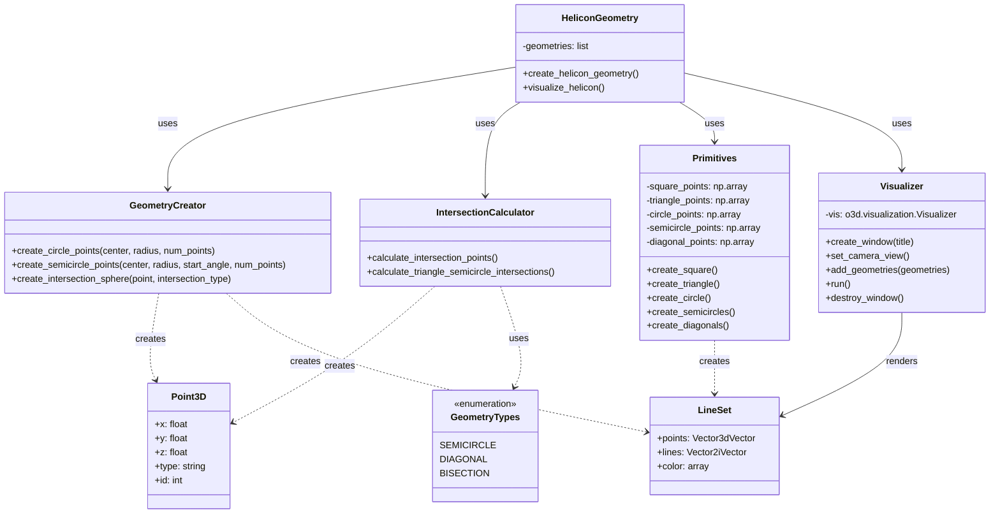

```mermaid
classDiagram
    class HeliconGeometry {
        -geometries: list
        +create_helicon_geometry()
        +visualize_helicon()
    }

    class GeometryCreator {
        +create_circle_points(center, radius, num_points)
        +create_semicircle_points(center, radius, start_angle, num_points)
        +create_intersection_sphere(point, intersection_type)
    }

    class IntersectionCalculator {
        +calculate_intersection_points()
        +calculate_triangle_semicircle_intersections()
    }

    class Primitives {
        -square_points: np.array
        -triangle_points: np.array
        -circle_points: np.array
        -semicircle_points: np.array
        -diagonal_points: np.array
        +create_square()
        +create_triangle()
        +create_circle()
        +create_semicircles()
        +create_diagonals()
    }

    class Visualizer {
        -vis: o3d.visualization.Visualizer
        +create_window(title)
        +set_camera_view()
        +add_geometries(geometries)
        +run()
        +destroy_window()
    }

    class GeometryTypes {
        <<enumeration>>
        SEMICIRCLE
        DIAGONAL
        BISECTION
    }

    class Point3D {
        +x: float
        +y: float
        +z: float
        +type: string
        +id: int
    }

    class LineSet {
        +points: Vector3dVector
        +lines: Vector2iVector
        +color: array
    }

    HeliconGeometry --> GeometryCreator : uses
    HeliconGeometry --> IntersectionCalculator : uses
    HeliconGeometry --> Primitives : uses
    HeliconGeometry --> Visualizer : uses
    GeometryCreator ..> Point3D : creates
    GeometryCreator ..> LineSet : creates
    Primitives ..> LineSet : creates
    IntersectionCalculator ..> Point3D : creates
    IntersectionCalculator ..> GeometryTypes : uses
    Visualizer --> LineSet : renders
```
