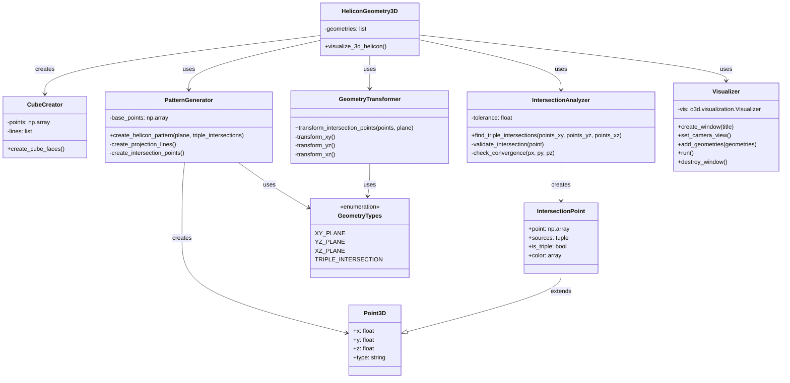

```mermaid
classDiagram
    class HeliconGeometry3D {
        -geometries: list
        +visualize_3d_helicon()
    }

    class CubeCreator {
        +create_cube_faces()
        -points: np.array
        -lines: list
    }

    class GeometryTransformer {
        +transform_intersection_points(points, plane)
        -transform_xy()
        -transform_yz()
        -transform_xz()
    }

    class PatternGenerator {
        +create_helicon_pattern(plane, triple_intersections)
        -create_projection_lines()
        -create_intersection_points()
        -base_points: np.array
    }

    class IntersectionAnalyzer {
        +find_triple_intersections(points_xy, points_yz, points_xz)
        -validate_intersection(point)
        -check_convergence(px, py, pz)
        -tolerance: float
    }

    class Visualizer {
        -vis: o3d.visualization.Visualizer
        +create_window(title)
        +set_camera_view()
        +add_geometries(geometries)
        +run()
        +destroy_window()
    }

    class Point3D {
        +x: float
        +y: float
        +z: float
        +type: string
    }

    class IntersectionPoint {
        +point: np.array
        +sources: tuple
        +is_triple: bool
        +color: array
    }

    class GeometryTypes {
        <<enumeration>>
        XY_PLANE
        YZ_PLANE
        XZ_PLANE
        TRIPLE_INTERSECTION
    }

    HeliconGeometry3D --> CubeCreator : creates
    HeliconGeometry3D --> GeometryTransformer : uses
    HeliconGeometry3D --> PatternGenerator : uses
    HeliconGeometry3D --> IntersectionAnalyzer : uses
    HeliconGeometry3D --> Visualizer : uses

    PatternGenerator --> Point3D : creates
    PatternGenerator --> GeometryTypes : uses
    IntersectionAnalyzer --> IntersectionPoint : creates
    GeometryTransformer --> GeometryTypes : uses

    IntersectionPoint --|> Point3D : extends
```