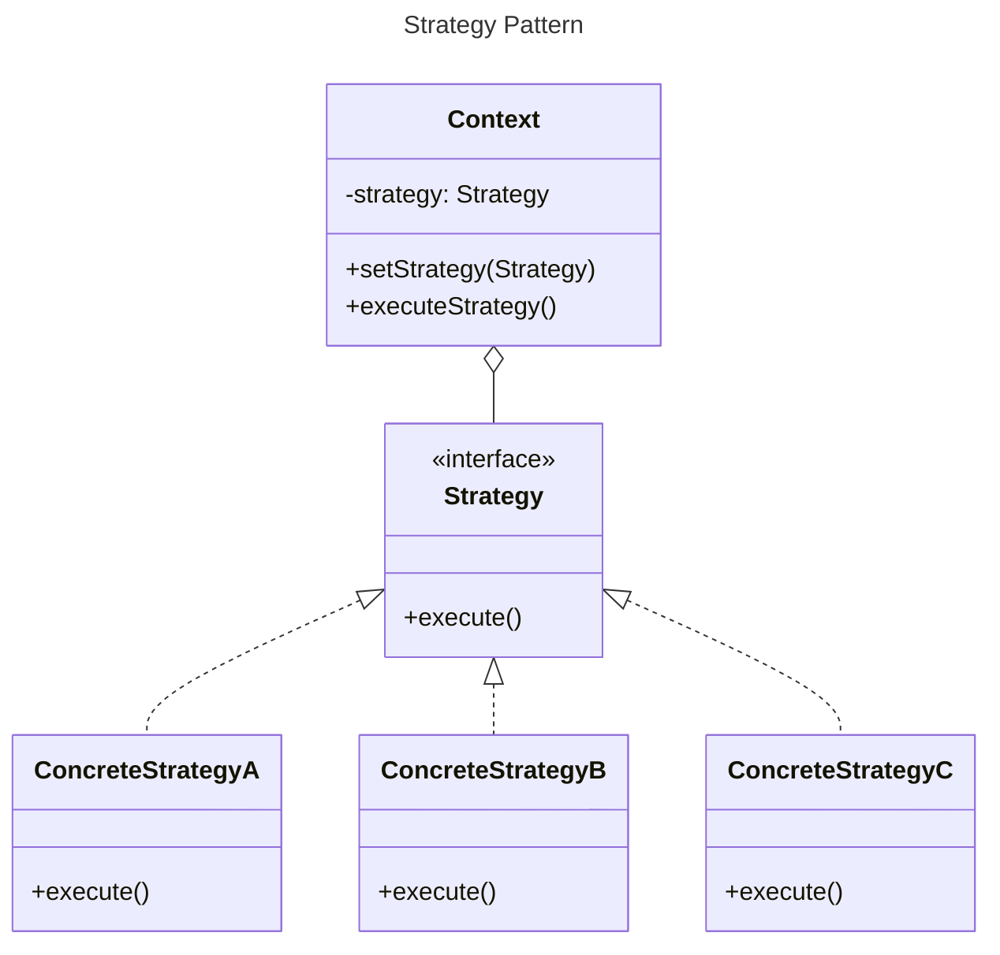

```mermaid
---
title: Strategy Pattern
---
classDiagram
    class Context {
        -strategy: Strategy
        +setStrategy(Strategy)
        +executeStrategy()
    }
    class Strategy {
        <<interface>>
        +execute()
    }
    class ConcreteStrategyA {
        +execute()
    }
    class ConcreteStrategyB {
        +execute()
    }
    class ConcreteStrategyC {
        +execute()
    }

    Context o-- Strategy
    Strategy <|.. ConcreteStrategyA
    Strategy <|.. ConcreteStrategyB
    Strategy <|.. ConcreteStrategyC
```
