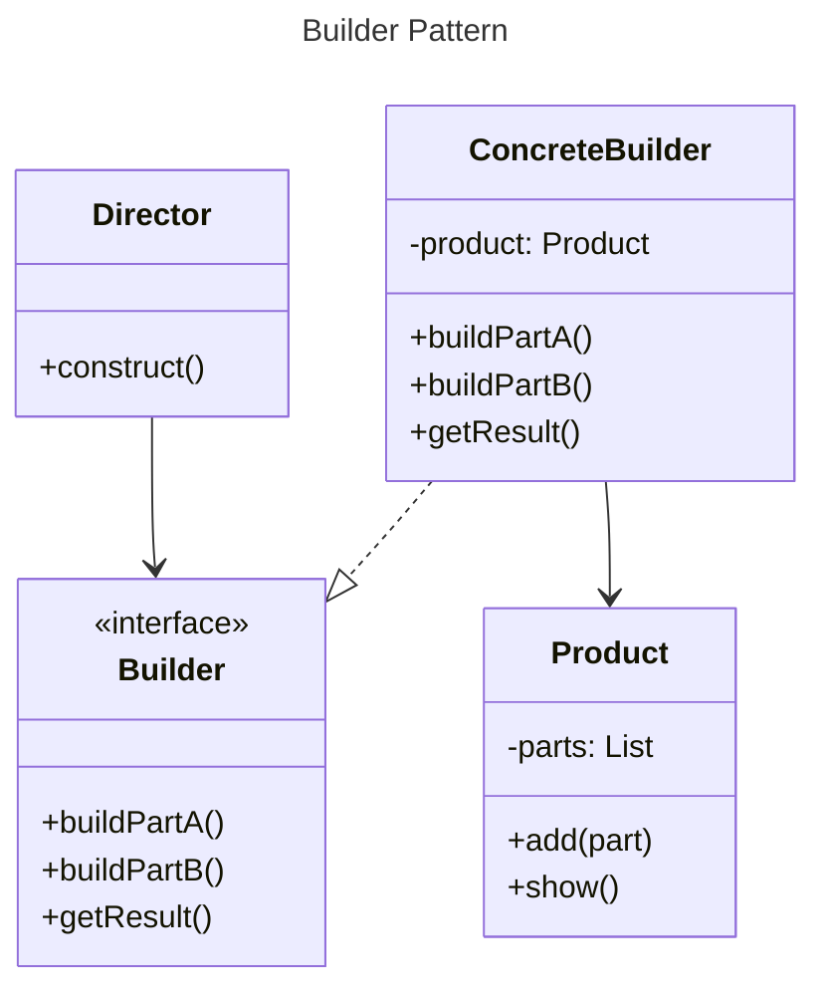

```mermaid
---
title: Builder Pattern
---
classDiagram
    class Director {
        +construct()
    }
    class Builder {
        <<interface>>
        +buildPartA()
        +buildPartB()
        +getResult()
    }
    class ConcreteBuilder {
        -product: Product
        +buildPartA()
        +buildPartB()
        +getResult()
    }
    class Product {
        -parts: List
        +add(part)
        +show()
    }

    Director --> Builder
    ConcreteBuilder ..|> Builder
    ConcreteBuilder --> Product
```
