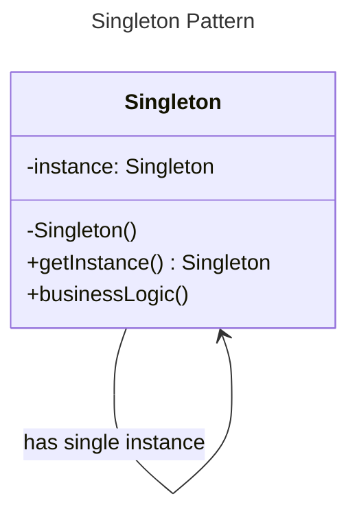

```mermaid
---
title: Singleton Pattern
---
classDiagram 
    class Singleton {
        -instance: Singleton
        -Singleton()
        +getInstance() Singleton
        +businessLogic()
    }
    Singleton --> Singleton : has single instance

```
